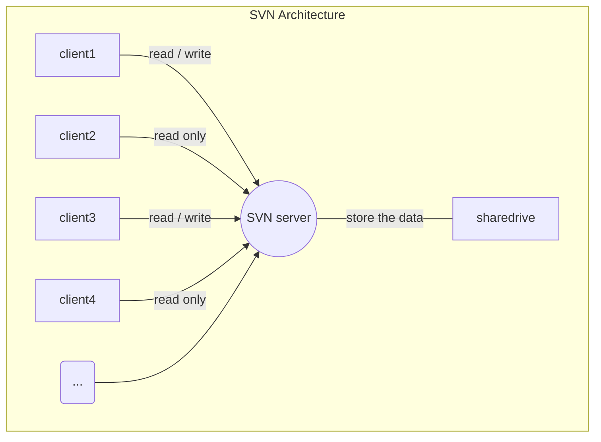
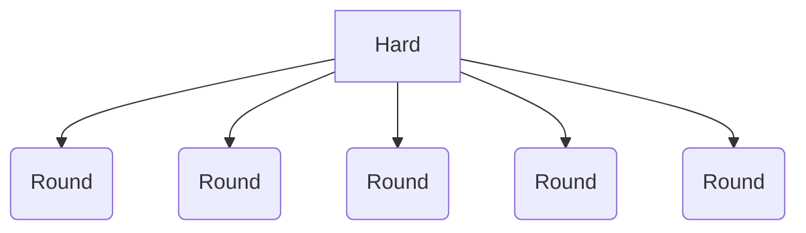

## 2.3类路径
类路径想象成一个大的整体，它由启动类路径、扩展类路径和用户类路径三个小路径构成
### 23.2 DirEntry

如何定义接口https://www.runoob.com/go/go-interfaces.html

go在线书籍：https://draveness.me/golang/
chapter02 command:chapter02.exe -Xjre "D:\Development\SDK\Java\jdk1.8.0_191\jre" java.lang.Object
$$
5^3 * log_2 +\frac{1}{2} \times \sum_{3}^{n}34 \div \sum{3x^n}\sqrt[2]{128}
$$
在文本中使用上下标n2=n+1+log1 &radic;5 30&deg;

### 有符号和无符号

有符号书使用0表示正数，1表示负数

无符号数： 1111 1111  值：255  1* 27 + 1* 26 + 1* 25 + 1* 24 + 1* 23 + 1* 22+ 1* 21 + 1* 20

有符号数： 0111 1111  值：127  1* 26 + 1* 25 + 1* 24 + 1* 23 + 1* 22+ 1* 21 + 1* 20

同样是一个字节，无符号数的最大值是255，而有符号数的最大值是127。原因是有符号数中的最高位被挪去表示符号了

1000 0000 	-128

1000 0001 	-127

1000 0010 	-126

1000 0011 	-125

... ...

1111 1110	 -2

1111 1111 	-1

-1值肯定大于-128 所以无论整数有几个字节都全部用1来表示-1, 1111 1111 - 1 就得到了-2 所以最小的负值是1000 0000

比如，假设有一 int 类型的数，值为5，那么，我们知道它在计算机中表示为：

00000000 00000000 00000000 00000101

原码：一个整数，按照绝对值大小转换成的二进制数，称为原码。

00000000 00000000 00000000 00000101 是 5的原码。

反码：将二进制数按位取反，所得的新二进制数称为原二进制数的反码。取反操作指：原为1，得0；原为0，得1。（1变0; 0变1）

1111111111111111 11111111 11111010  反码是相互的，所以也可称：

补码：反码加1称为补码。

11111111 11111111 11111111 11111010 + 1 = 11111111 11111111 1111111111111011

所以，-5 在计算机中表达为：11111111 11111111 1111111111111011。转换为十六进制：0xFFFFFFFB。

常用的机器数有三种：原码、补码和反码。

1．原码

  通俗定义

将数的符号数码化，即用一个二进制位表示符号：对正数，该位取0，对负数，该位取1。

而数值部分保持数的原有形式(有时需要在高位部分添几个0)。这样所得结果为该数的原码表示。

例，x=+1001010，y= -1001010，z= 一1110(=一0001110)。当原码为8位时，x、y和z的原码分别是：

  [x]原=01001010；

  [y]原=11001010；

  [Z]原=10001110．

其中最高位为符号位。

2)正规定义

2．反码

反码：正数的反码为原码，负数的反码是原码符号位外按位取反。

例如：

X1=+67=+100 0011B     ，[X1]反=0100 0011B

X2=-67=-100 0011B     ，[X2]反=1011 1100B

对正数，其反码与原码相同，也与补码相同。对负数，其反码等于原码除符号位外，按位求反(末位不加1)。利用反码也可使带符号数的加、减法转化为单纯的加法，但麻烦一些。

一般把求反码作为求补的中间过程，即 [x]补=[x]反+1。

3．补码

1)补码的引进和定义

据统计，在所有的运算中，加、减运算要占到80％以上，因此，能否方便地进行正、负数加、减运算，直接关系到计算机的运行效率。

把一个负数加模的结果称为该负数的补码(结果是一个正数，它和该负数是等价的，确切地说，是一对一的，因而可看作是该负数的编码)，定义正数的补码就是它本身，符号位取0，即和原码相同。这就是补码的通俗定义。将这个定义用数学形式表示出来，就可得到补码的正规定义：

其中n为补码的位数。这个定义实际也将真值的范围给出来了，当n=8时，一27≤x<27。和原码相比，补码表示可多表示一个数。当n=8时，多表示的数是一27=一128。

 2)补码的求法

对正数，补码同原码。

例如，x=+0101001，[x]补=[x]原=00101001。

对负数，由定义求补码，需做减法，不方便。经推导可知，负数的补码等于其原码除符号位外按位“求反”(1变0，0变1)，末位再加1。

例如，y=一0001100，[y]原=10001100，[Y]补=11110011+1=11110100。

算法：

1.正数的补码与原码相同；

2.负数的补码由原码除符号位保持不变外，其余各位按位取反，再在末位加1。

  [x]补=[x]反+1 

### 解析class 文件

byte(字节)=8 bit(位)

 javap -verbose ClassFileTest.class