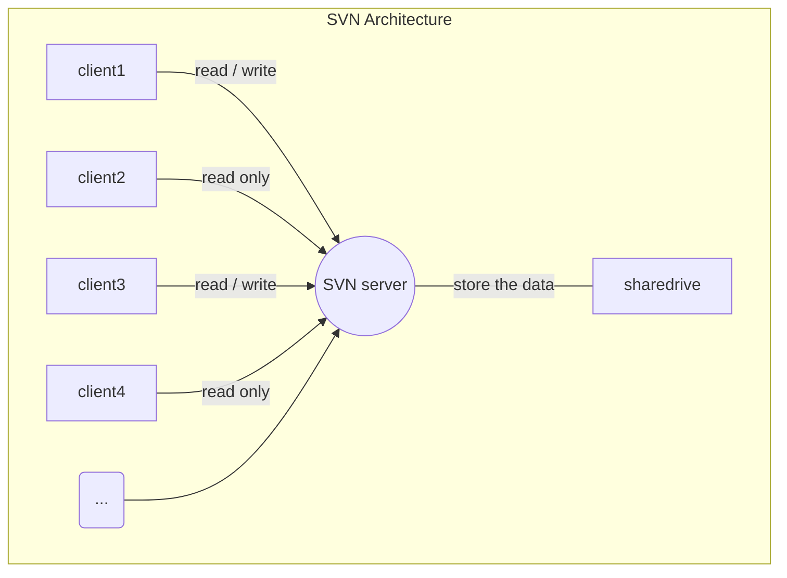
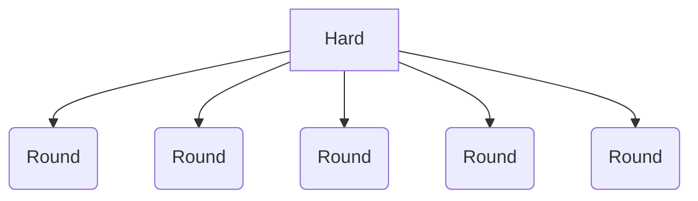

```mermaid
graph TD

    subgraph SVN Architecture

    client1-->|read / write|SVN((SVN server))

    client2-->|read only|SVN

    client3-->|read / write|SVN

    client4-->|read only|SVN

    client5(...)-->SVN

    SVN---|store the data|sharedrive

    end
```

```mermaid
graph TD
A[Hard] 
A --> B(Round)
A --> C(Round)
A --> D(Round)
A --> E(Round)
A --> F(Round)

```
## 2.3类路径
类路径想象成一个大的整体，它由启动类路径、扩展类路径和用户类路径三个小路径构成
